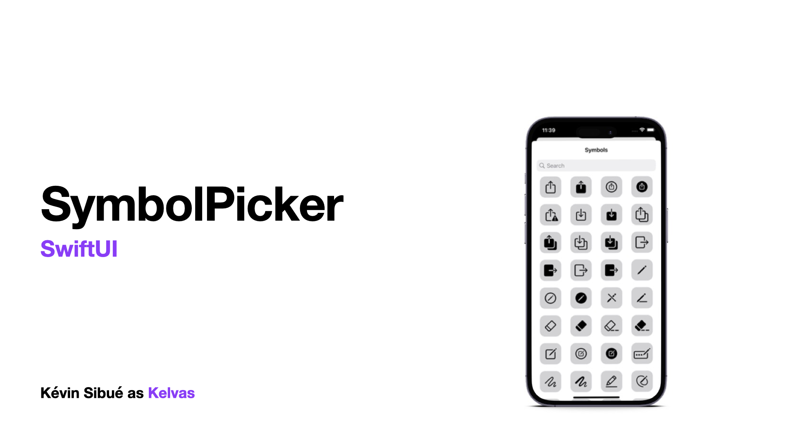
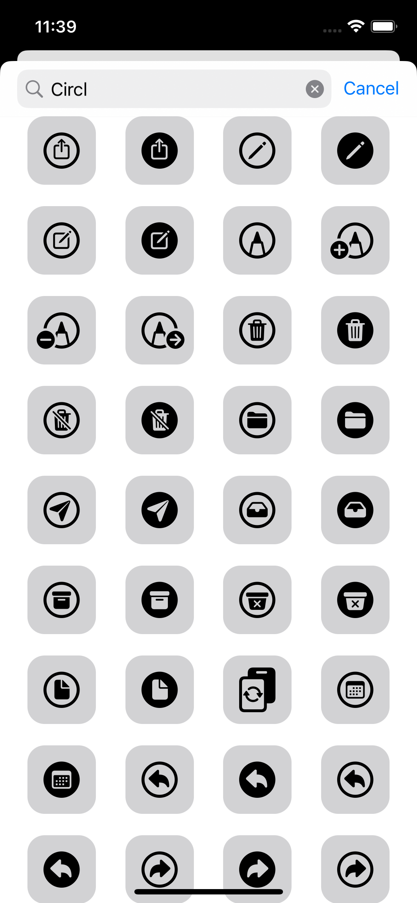
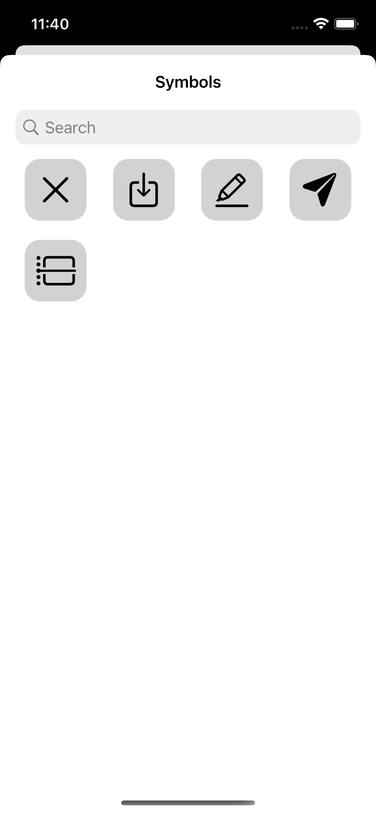
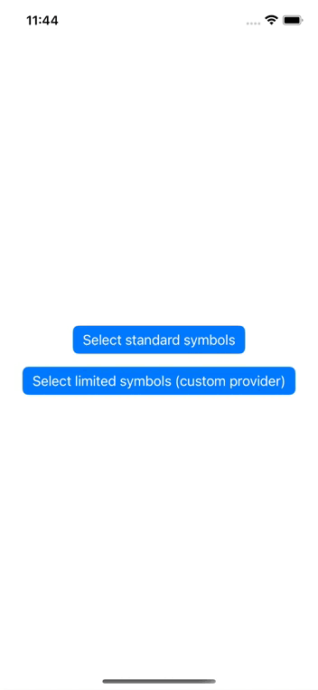

## Goal

You probably know SF Symbols from Apple allowing you to use icons and symbols directly in your application without having to import any image.

SymbolPicker allows you to offer a view to your users to select a symbol very easily.

## Screenshots and video

|Standard|Search|Limited|
|---|---|---|
||||



## Dependencies

- SwiftUI (iOS >= 15.0)

## How install it?

Nowaday we only support Swift Package Manager. You can use build-in UI tool for XCode with this search words: `SymbolPicker` or you can add it directly with this following command :

```swift
.package(url: "https://github.com/Kelvas09/SymbolPicker.git", from: "1.0.0")
```

## How use it?

First of all you have to import the library `SymbolPicker`:

```swift
import SymbolPicker
```

You then have the option of using the `SymbolPickerView`. This view represents the list of selectable symbols.

The latter is not embedded in a NavigationView. If you want to display it with a title, you have to do it yourself:

```swift
...
NavigationView {
    SymbolPickerView(selectedSymbol: $selectedSymbol, selectedColor: .orange)
        .navigationTitle("Symbols")
        .navigationBarTitleDisplayMode(.inline)
}
...
```

Here is a complete example:

```swift
//
//  ContentView.swift
//  SymbolPickerSample
//
//  Created by Kévin Sibué on 13/01/2023.
//

import SwiftUI
import SymbolPicker

struct ContentView: View {

    @State
    var selectedSymbol: Symbol?

    @State
    var displaySymbolPicker: Bool = false

    var body: some View {
        VStack {
            VStack {
                Image(systemName: selectedSymbol?.value ?? "")
                    .font(.largeTitle)
            }
            .padding(8)
            Button {
                displaySymbolPicker = true
            } label: {
                Text("Select standard symbols")
            }
            .buttonStyle(.borderedProminent)
        }
        .padding()
        .sheet(isPresented: $displaySymbolPicker) {
            NavigationView {
                SymbolPickerView(selectedSymbol: $selectedSymbol, selectedColor: .orange)
                    .navigationTitle("Symbols")
                    .navigationBarTitleDisplayMode(.inline)
            }
        }
    }

}

struct ContentView_Previews: PreviewProvider {
    static var previews: some View {
        ContentView()
    }
}

```

### Select color

When a user selects a symbol, it is highlighted. By default the selection color is `blue` but you can change this value when creating the view: 

```swift
SymbolPickerView(selectedSymbol: $selectedSymbol, selectedColor: .orange)
```

### Enable search

By default the search for symbols is allowed in the picker, it is however possible to change this setting when creating the view:

```swift
SymbolPickerView(selectedSymbol: $selectedSymbol, searchEnabled: false)
```

⚠️ **WARNING** Search is only possible when `SymbolPickerView` is embed on `NavigationView`.

### Custom symbols provider

`SymbolPickerView` embeds `SymbolProvider` protocol with a default implementation: `DefaultSymbolProvider`. This class allows to retrieve all existing symbols. 

When you build an `SymbolPickerView`, by default it uses this class to get the list of symbols to display.

If you want to use your own symbol list, you can create your own class by implementing the `SymbolProvider` protocol :

```swift
import Foundation
import SymbolPicker

final class LimitedSymbolProvider: SymbolProvider {

    func getAll() -> [Symbol] {
        return [
            Symbol(value: "xmark"),
            Symbol(value: "square.and.arrow.down"),
            Symbol(value: "highlighter"),
            Symbol(value: "paperplane.fill"),
            Symbol(value: "calendar.day.timeline.left"),
        ]
    }

}
```

And then use it in the creation of the view:

```swift
...
NavigationView {
    SymbolPickerView(selectedSymbol: $selectedSymbol, selectedColor: .orange, symbolProvider:  LimitedSymbolProvider())
        .navigationTitle("Symbols")
        .navigationBarTitleDisplayMode(.inline)
}
...
```

## Samples

You can access to sample project on folder `SymbolPickerSample`
